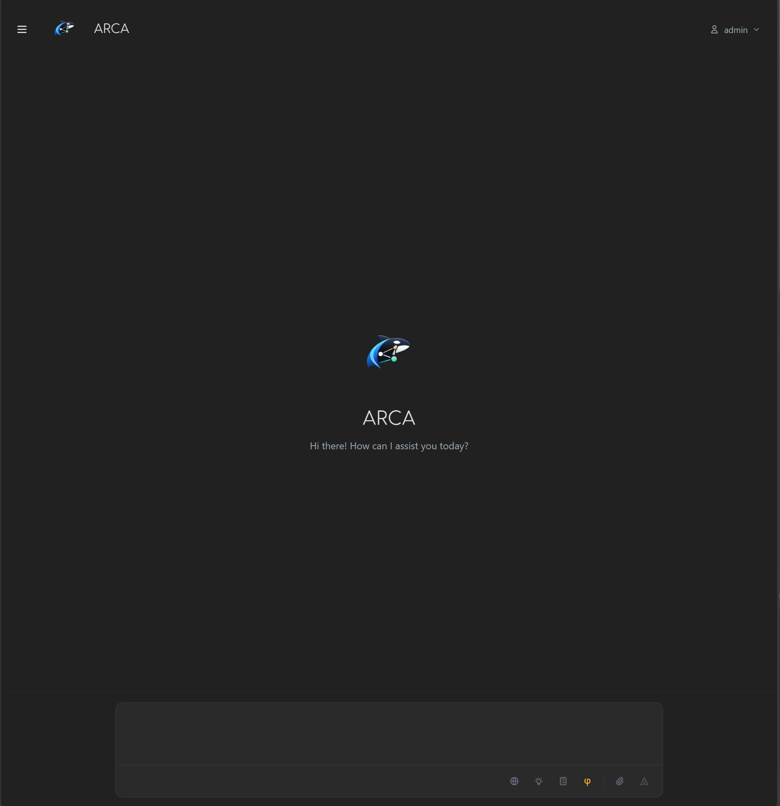
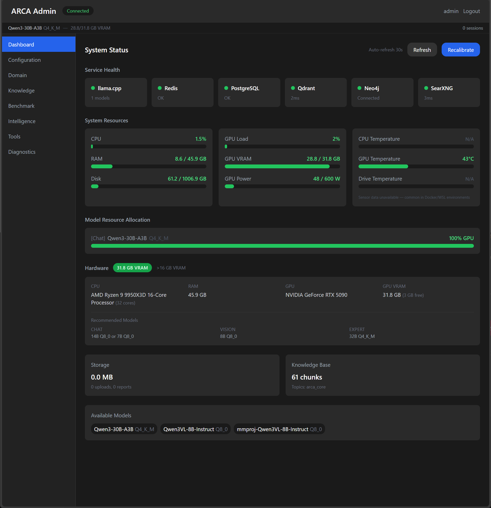
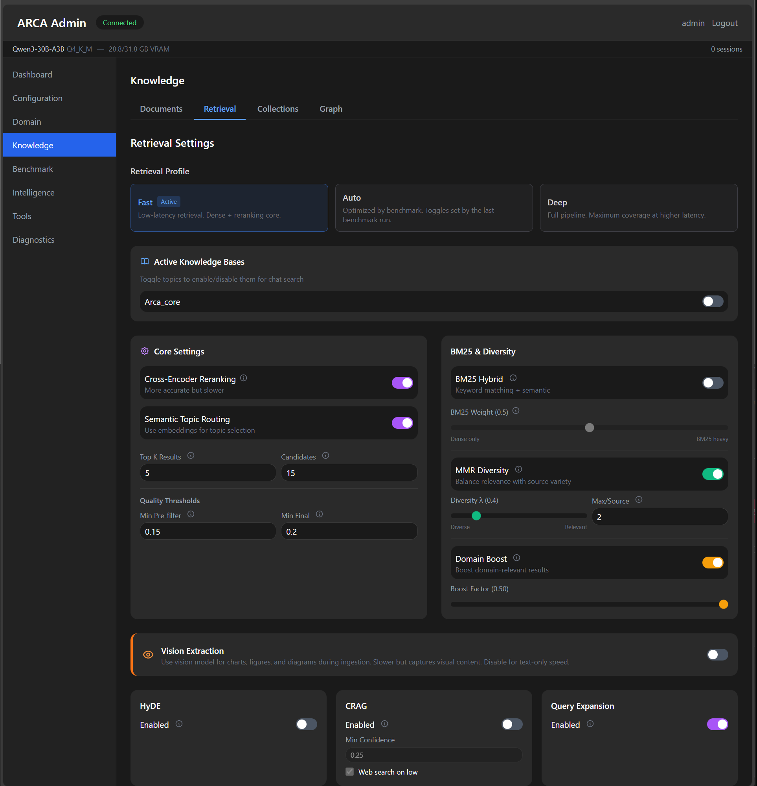
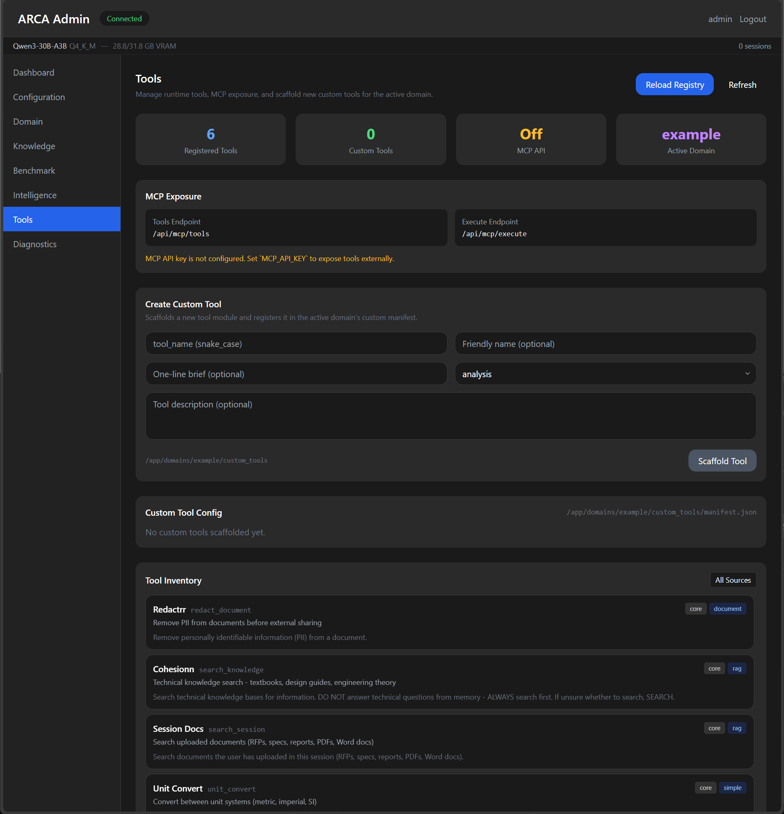

<p align="center">
  
</p>

<h1 align="center">ARCA</h1>
<p align="center"><strong>Local-first RAG platform for technical document workflows</strong></p>

ARCA is a self-hosted platform that turns your technical documents into a searchable, retrievable knowledge base powered by local LLMs. Ingest a corpus, benchmark your retrieval pipeline against it, and get grounded answers with citations — all on your hardware, no cloud dependencies.

## What ARCA Is

- A local-first RAG platform: chat, retrieval, ingestion, admin controls, and tooling in one stack
- A model playground for swapping GGUF models and retrieval settings at runtime
- A domain-packable system: ship specialized tools, vocabulary, and personality without forking core code
- An MCP-capable backend that external AI clients can use as a retrieval tool

## What ARCA Is Not

- A polished SaaS product
- A zero-config, zero-debug setup for every machine
- A cloud-hosted managed service

## Why ARCA?

Most open-source RAG tools fall into two camps. Turnkey apps get you a local chatbot in minutes but give you one retrieval mode and no way to tune it. Framework kits give you every building block imaginable but leave you to wire up auth, model lifecycle, VRAM management, document processing, admin UIs, and benchmarking yourself — integration work that takes months.

ARCA is the middle ground: a complete, deployable platform with research-grade retrieval depth. Seven retrieval modes fused through Reciprocal Rank Fusion and cross-encoder reranking, but you don't have to use all of them. The benchmark harness tells you which ones actually help on *your* corpus, and the profile system lets you activate them selectively.

It also handles the infrastructure that framework users build from scratch: hardware-aware VRAM budgeting, automatic model bootstrap, document processing with per-page vision routing, an adaptive personality engine, and a full admin panel for runtime tuning without SSH.

## UI Preview

### Chat Frontend



### Admin: Model Management



### Admin: Knowledge



### Admin: Tools



## Honest Requirements

ARCA runs on consumer hardware, but this is still a local LLM system with real resource needs.

- **GPU**: 16 GB+ VRAM recommended (24 GB+ is ideal)
- **RAM**: 32 GB+ system memory
- **Disk**: 60+ GB free (models + caches + data)
- **Docker Desktop** with GPU passthrough configured

CPU-only mode exists but is much slower and not the default.

## Quick Start

### 1. Clone

```bash
git clone https://github.com/3spky5u-oss/ARCA.git
cd ARCA
```

### 2. Bootstrap (one command)

Unix/macOS:

```bash
./scripts/bootstrap.sh
```

Windows PowerShell:

```powershell
./scripts/bootstrap.ps1
```

### 3. Open ARCA

- Frontend: `http://localhost:3000`
- Backend API: `http://localhost:8000`

Create your first account, then open `/admin`.

## What Bootstrap Does

- Creates `.env` from `.env.example` if needed
- Generates secure local DB secrets
- Uses GPU-first compose defaults
- Detects GPU VRAM tier and sets tier-appropriate chat/code/expert defaults
- Downloads missing configured models
- Runs preflight checks
- Pulls images and starts the stack

## First-Run Download Warning

ARCA auto-downloads configured model files on first boot. This is intentional for easier onboarding, but it can be large and slow.

On first bootstrap, ARCA auto-selects model defaults by detected total GPU VRAM and only downloads that tier's configured models.

| Total GPU VRAM (detected) | Auto chat/code/expert default | Auto vision default | Approx first pull |
|---|---|---|---|
| 0-8 GB | `Qwen3-8B-Q4_K_M.gguf` | `Qwen3VL-8B-Instruct-Q4_K_M.gguf` | ~10-12 GB |
| 8-12 GB | `Qwen3-8B-Q4_K_M.gguf` | `Qwen3VL-8B-Instruct-Q4_K_M.gguf` | ~10-12 GB |
| 12-16 GB | `Qwen3-14B-Q4_K_M.gguf` | `Qwen3VL-8B-Instruct-Q4_K_M.gguf` | ~13-16 GB |
| 16-24 GB | `Qwen3-14B-Q4_K_M.gguf` | `Qwen3VL-8B-Instruct-Q8_0.gguf` | ~18-20 GB |
| 24-32 GB | `Qwen3-30B-A3B-Q4_K_M.gguf` | `Qwen3VL-8B-Instruct-Q8_0.gguf` | ~27-30 GB |
| 32-48 GB | `Qwen3-30B-A3B-Q4_K_M.gguf` | `Qwen3VL-8B-Instruct-Q8_0.gguf` | ~27-30 GB |
| 48-96 GB | `Qwen3-30B-A3B-Q4_K_M.gguf` | `Qwen3VL-8B-Instruct-Q8_0.gguf` | ~27-30 GB |
| 96+ GB | `Qwen3-30B-A3B-Q4_K_M.gguf` (safe default) | `Qwen3VL-8B-Instruct-Q8_0.gguf` | ~27-30 GB |

`mmproj-Qwen3VL-8B-Instruct-Q8_0.gguf` (~1 GB) is also pulled when the vision slot is configured.

Plus embedding/reranker caches on first use (~1-3 GB).

If you have higher-end multi-GPU hardware, treat these as starter defaults and override `LLM_*_MODEL` as needed.

## Daily Commands

Update + restart:

```bash
./scripts/update.sh
# or
python scripts/arca.py update
```

Start/stop:

```bash
python scripts/arca.py up
python scripts/arca.py down
```

Health checks:

```bash
python scripts/arca.py doctor
python scripts/arca.py doctor --deep-gpu-check
python scripts/arca.py doctor --json --json-out data/preflight.json
docker compose logs -f backend
```

## What's Under the Hood

**Hybrid retrieval pipeline.** Seven retrieval modes — dense embedding, BM25 sparse, RAPTOR hierarchical summaries, GraphRAG entity traversal, global community search, HyDE hypothetical documents, and CRAG web fallback — fused through Reciprocal Rank Fusion and cross-encoder reranking. Each mode is independently toggleable. Profiles control which are active, and the benchmark harness measures which actually help on your specific corpus.

**Document processing with vision routing.** PDF pages are classified by content type (text, visual, scanned) and routed accordingly. Text pages go through fast extraction; charts and figures go through a vision LLM for structured data capture. Quality checks catch garbled text and trigger re-extraction automatically.

**Hardware-aware scaling.** ARCA detects your GPU, VRAM, and system memory at startup and configures context windows, model selection, and GPU layer offloading to match. A 12 GB card gets a different default config than a 32 GB card - automatically. For multi-GPU rigs, you can route components by device map and optionally enable llama.cpp tensor split per slot.

**Domain pack specialization.** A domain pack is a config directory (manifest + lexicon + optional tools) that customizes vocabulary, retrieval behavior, personality, and tooling without touching core code. Switch domains by changing one environment variable.

**Integrated benchmark harness.** A multi-phase benchmark evaluates chunking strategies, embedding models, reranker models, embedder-reranker combinations, parameter sweeps, LLM answer quality, and component ablation — all against your corpus. Results drive profile defaults so tuning is evidence-based, not guesswork.

**Adaptive personality engine.** Phii analyzes user communication patterns (brevity, formality, technical depth, domain specialty) and adjusts response style across sessions. Corrections are learned and applied with confidence tracking.

**Admin panel.** Runtime tuning, model assignment, knowledge management, graph visualization, benchmark execution, and diagnostics — from the browser, no SSH required.

**MCP integration.** ARCA exposes its retrieval pipeline as MCP tools, so external AI clients (Claude Desktop, GPT, custom agents) can query your knowledge base directly.

## Retrieval Tuning Reality Check

ARCA exposes many retrieval stages so you can tune, not so you should enable everything at once.

Running all stages simultaneously can increase latency, add noise, and in some corpora reduce quality. The benchmark report demonstrates this: on a structured corpus, the full deep pipeline scored 7% worse than dense-only retrieval at 70x the latency.

Recommended workflow:

1. Feed in a sample corpus.
2. Run the benchmark and let it complete.
3. Apply the best-performing profile.
4. Tweak by hand only where your real queries still need adjustment.

Treat the full pipeline as a toolbox, not a mandatory stack.

## Benchmark-Backed Defaults

We benchmarked 168+ configurations across 14 layers using 40 ground-truth and 20 adversarial queries. Dense-first retrieval beat the full pipeline on 4 of 5 query types at 70x less latency. The one exception: cross-reference queries, where GraphRAG traversal earned its cost. A 27-combination cross-model sweep confirmed the current defaults (Qwen3-Embedding-0.6B + Jina-Reranker-v2-Turbo) as the optimal stack.

Your corpus will be different — run your own benchmark.

- [Benchmark V2 Public Report](docs/BENCHMARK_V2_PUBLIC.md)
- [Technical Whitepaper](docs/WHITEPAPER.md)

## Modes

### Standard mode

Local chat + tools + retrieval all active.

### MCP-only mode

Set:

```env
MCP_MODE=true
MCP_API_KEY=<random-secret>
```

In MCP mode, local chat responses are disabled and local llama-server startup is skipped.
ARCA still runs as a tool/retrieval backend with admin UI.

## Services and Ports

- Frontend: `3000`
- Backend API: `8000`
- Qdrant: `6333`
- PostgreSQL: `5432`
- Neo4j: `7474`
- Redis: `6379`
- SearXNG: `8080`

## Documentation

If you are a power user (or pointing another AI agent at this repo), start here:

- [API Quick Reference](docs/API.md)
- [API Full Reference](docs/API_FULL.md)
- [Configuration Guide](docs/dev/config.md)
- [Troubleshooting](docs/dev/troubleshooting.md)
- [Domain Pack Guide](docs/dev/domain_packs.md)
- [Adding Tools Guide](docs/dev/adding_tools.md)
- [Technical Whitepaper](docs/WHITEPAPER.md)
- [Benchmark V2 Public Report](docs/BENCHMARK_V2_PUBLIC.md)
- [Release Notes v0.1.0](docs/RELEASE_NOTES_v0.1.0.md)

## Support

This project is maintained by one person with a full-time job. I fix real issues, but I cannot promise instant support on every edge case.

If you open an issue, include enough detail to reproduce:

- OS and Docker version
- GPU + driver details
- `.env` values relevant to models (redact secrets)
- Backend logs
- Exact command you ran

Issue templates are provided for:

- bug reports
- setup help
- feature requests

Reasonable, reproducible reports get priority.

## Public/Private Workflow

If you maintain private + public repos, use:

```bash
python scripts/export_public.py --clean
```

This creates a sanitized export using `.public-export-include` and `.public-export-exclude`.
If you run a stack from the export folder, stop it first (`docker compose down`) before `--clean`.
The script refuses to clean when running containers still mount the export path.
Review `PUBLIC_EXPORT_REPORT.md` in the generated export directory before publishing.

## Security and Privacy

ARCA is designed for local-first operation.
You control where it runs and what data it sees.
Read [Security Policy](docs/SECURITY.md) for details and caveats.

## License

MIT. See [LICENSE](LICENSE).

## Built By

I'm a geotechnical engineer and homelabber. ARCA started as a way to make local LLMs actually useful for technical document work — the kind where you need real answers from real reports, not chatbot parlor tricks.

The retrieval pipeline, the benchmark harness, the domain pack system, the adaptive personality engine — it all came from solving problems I hit while trying to make RAG work on messy, real-world technical corpora. I'm sharing it because the local AI space needs more tools built by people who actually use them.

If it saves you time, that's the point.

